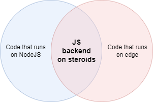

# JS backend on steroids

Guide to make and run the ultimate backend on NodeJS or V8.



> [!CAUTION]
> It's an unfinished developer guide, containing typo and other mistakes. Come back later.

## Goals

* You want a server for your microproject, or your proof-of-concept app.
* You want to make it simple.
* You want a short learning curve to ship your first version fast.
* You want to test offline.
* You want to go online immediately...
* ...without a lot of configurations headache.
* It's a small project at start...
* ...but you want the possibility to scale up to serve the whole world...
* ...without thinking about rewriting anything in the code, and...
* ... without thinking about infrastructure, like load balancers, servers, encryption, etc.
* YOU. JUST. WANT. TO. CODE.
* NOW.
* Oh, and you want it all for free. Or (in worst case) nearly free. At least until you reach a significant userbase.

**ARE YOU NUTS?!**

No, you are not.<br>
This is the dream of the developer, and yes, it's all possible.<br>
Welcome to this tutorial.

## What is this?

It's a developer guide with best practices as I personally see. First I wanted to make a small step-by-step guide just for me, buit I realized I can do a nice tutorial if I add some more comments.

### Two ways of deploying and the problem with migration

You have to choose.

* You can make a code that runs on a "traditional" servers. (It's not truly traditional and definiately not unscalable, because as you will see, you can deploy this in a container cluster, that you can scale that up as big as you want.)
* Or you can make a code that runs on the edge, without thinking about servers: deploy all over the world immediately.

There are cons and pros on both solution, but what should you choose? You don't know yet, and that is the problem you are facing with.

#### NodeJS and its problems

If you are going to build something new, and you have big plans, people usally think it's better to choose the "traditional" way to make servers, and write codes that runs on for example NodeJS backend. Because you have full control of what's on the machines.

But later when you get some visitors and decide to start to scale this up, you will get a bunch of new problems that you can not imagine in the beginning. Like geo-routing, load balancers, auto scaling, certificates, CI/CD, secret management, and the list is far-far from finished. 

You realize that it would be much better to run in the edge, and eliminate ALL of your scaling problems. But your code is not compatible, so you need to rewrite EVERYTHING.

Nah. You will stay with NodeJS.

#### Edge and its problems

On the other hand you can choose edge computing at the beginning, where you just upload you backend code, and scale globally and magically, faster than you read this sentence.

But later you realize you need some more control over your servers. For example you need the ghostscript lib to do something with the user-uploaded PDFs. Of course you can not install ghostscript on edge servers, so what should you do now?

You realize that you should use a custom server with your full constrol of dependencies, but your code is made for the edge, and you need to rewrite everything.

### Recommended solution

The best thing you can do is to make your project as compatible as possible with both the two ways, and you can decide later. **I recommend you to write your backend code thinking about edge first, because it's faster, easier and cheaper.** (I mean it's free for small projects, and much cheaper on scaling projects.) And you can really just focus on developing your great application.

Later if you realize that you need to do some heavy tasks, you can always make microservices, as small containers to do the job with the custom installed libs (like ghostscript). Also if you are fearing of latter some big trouble, of something you did not calculate with (like extraoridany price), you can always switch back to NodeJS immediately.

**It's easy to go from edge to NodeJS.<br>
It's hard to go from NodeJS to edge.**

That's why you want to make a compatible codebase at it's heart, and you will need to modify just a few lines of code to go from one platform to another.


## Requirements

* Basic knowledge of software engineering, JavaScript and cloud concepts. We will not discuss terminology, but use technologies in this guide.
* `node` and `npm` installed in your machine - https://nodejs.org/
* Docker Desktop for running containers - https://www.docker.com/products/docker-desktop/

## What are we going to build?

A small backend webapp, with code structure, performance and security best practices. We will make a code that you can run on NodeJS and even on edge platforms, like Cloudflare Workers. This repository is just a bunch of snippets and notes about leverage the core concepts and deploy you software wordwide.

## Part0: get ready

Install some dependencies globally to you developer machine, if you did not do that already:
```
npm install -g nodemon pnpm
```

Nodemon is for auto-restarting you Node server, and pnpm is a "Fast, disk space efficient package manager". Make a shorthand for `pnpm` as `pn`: https://pnpm.io/installation#using-a-shorter-alias

## Part1: your software

### Git

Make a git repository of course.

### Init

In the empty root, make a folder called `app`. In terminal, go to this folder, then type ```pn init```. This will make you a standard starting point of your software.

### package.json

Modify to this:

```
...
"main": "app.js",
"type": "module",
"scripts": {
    "start": "node app.js",
    "dev": "nodemon app.js",
    "test": "echo \"Error: no test specified\" && exit 1"
},
...
```

* We made a new entrypoint: `app.js`.
* We use `node` for running in live, and `nodemon` for development purposes. Nodemon will restart the server automatically if you change a file.
* `"type": "module"` is required for use the module syntax. You could do otherwise, but it's recommended since we want to ship our app with not just NodeJS but later as an edge function with just minimum modifications. Without this setting you will get the 'Cannot use import statement outside a module' later. More info [here](https://www.dhiwise.com/post/fix-the-error-cannot-use-import-statement-outside-a-module) and [here](https://adamcoster.com/blog/commonjs-and-esm-importexport-compatibility-examples)

### Hono

[ExpressJS](https://expressjs.com/) is the most famous NodeJS framework, however, we will use [Hono](https://hono.dev/). Hono is ultrafast, can do everything that ExpressJS does, and compatible all of the JavaScript runtimes (NodeJS, Cloudflare Workers, Lambda@Edge, Bun, Fastly and their friends). On the contrary, ExpressJS is only compatible with NodeJS.

It's true that Hono wasn't built for NodeJS originally, but we can make it work easily, therefore we can leverage this possibility to not rewrite our whole codebase if we decide to change our backend environment from NodeJS to the edge. We need an extra lib for NodeJS besides Hono, so in the `app` folder type:

```
pn i hono @hono/node-server
```

This will make the `package.json`, `pnpm-lock.yaml`, and the `node_modules` folder.

### .gitignore

Do not forget to make the .gitignore file in the root:

```
**/node_modules/*
```

### app.js

In the `app` folder add a file called `app.js`. Fill up with the following:

```
import { serve } from '@hono/node-server'
import { Hono } from 'hono'

const app = new Hono()
app.get('/', (c) => c.text('hello hono!'))

serve(app)
```

### First run

Open terminal, go to the `app` folder, then type
```
pn dev
```

Yay!

### Recommended upgrades

#### Secure headers, logging, pretty json

#### Template engine

#### Code structure

## Part2: Run in the cloud as NodeJS

### Dockerization

### Dockerhub build

### Digital Ocean deploy

### Cloudflare, protection, https

## Part3: Run in the cloud as an edge function